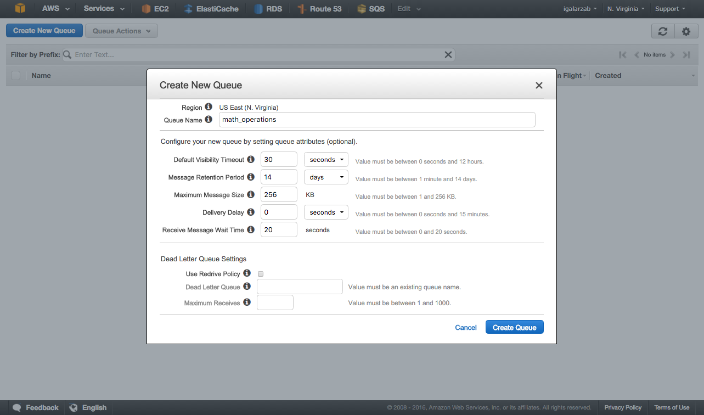

.. _quickstart:

Quickstart
==========

This page gives a good introduction in how to get started with SQJobs. First, make sure that SQJobs
is :ref:`installed <installing>` and is in it lastest version.

Creating a new job
------------------

A job is simply a class that inherits from ``sqjobs.Job``. It must implement the method ``run()``,
where the job code must reside::

    from sqjobs import Job

    class Adder(Job):
        name = 'my_custom_adder'
        default_queue_name = 'math_operations'

        def run(self, num1, num2):
            return num1 + num2

One of the most important attributes of a job is it ``name``. The job's name must be unique and it's
used by the workers to know which job must be executed when returning a new message from the broker.
The default value if it's not specified is the class name, ``Adder`` in the previous example.

There is also an attribute called ``default_queue_name`` that defines where the job will be enqueued
if another queue is not given. The default value of the attribute (if not set) is ``sqjobs``.

The arguments of the ``run()`` method are arbitrary, and depend on the arguments of the operation
you are creating. It must be compatible with the arguments that are used to enqueue the job.

Creating a queue in SQS
-----------------------

You need to create a queue in `SQS <https://aws.amazon.com/sqs/>`_ to be able to use SQJobs, as it's
the only broker that it's supported at this moment. Creating queues in AWS SQS is something really
easy. First you need to have an AWS account created.

Then, just go to the SQS management console and press the **Create New Queue** button. The
management console will present you the following dialog:

Give the queue a name (*math_operations* in our example), set the settings you want and press the
**Create Queue** button. After that, your queue will be created and configured to be used by SQJobs.

You can check the information about your queues (like the number of available messages) in the main
window of the SQS management screen. There are more information about SQS and it configuration in
`their official documentation <https://aws.amazon.com/documentation/sqs/>`_.

Enqueuing jobs
--------------

To enqueue a job to SQS you need to create a new broker and use the ``add_job()`` method::

    from sqjobs import create_sqs_broker

    broker = create_sqs_broker(access_key='ak', secret_key='sk', region_name='us-west-1')
    broker.add_job(AdderJob, 3, num2=4)

You can get your *access key* and *secret key* values from your AWS account (check at `their
official documentation <http://docs.aws.amazon.com/AWSSimpleQueueService/latest/SQSGettingStartedGuide/AWSCredentials.html>`_
how to do it).

The ``add_job()`` method receives one mandatory argument: the job class you want to enqueue. After
that, you can add any number or arguments (args or kwargs) you need to execute properly the job.

Notice that the number and name of the arguments must be the same than the signature of the
``run()`` method of the job.

The ``add_job()`` method also accept some arguments with a special meaning:

* ``queue_name``: Set this to another queue if you don't want to enqueue the job in the default job
  specified by the ``default_queue_name`` attribute of the class.

Executing a worker
------------------

To execute the existing jobs in the SQS queues you need to have at least one executing worker.

Execute a worker is something very simple::

    $ sqjobs sqs worker math_operations --aws-access-key=AK --aws-secret-key=SK --jobs=examples
      Found new job: Adder

You have to provide at least four different arguments:

* The queue name (*math_operations* in our example).
* The access key to use the AWS API.
* The secret key to use the AWS API.
* The python module where the jobs are located.

There are a lot of options in the CLI program. You can check them all running the help info::

    $ sqjobs --help

    SQJobs - Simple Queue Jobs.

    Usage:
      sqjobs <broker> worker [options] <queue_name>
      sqjobs (-h | --help)
      sqjobs --version

    Options:
      --jobs=<module>               Python module where jobs are located [default: .jobs]

    AWS SQS Options:
      --aws-access-key=<ak>         Access key to access SQS
      --aws-secret-key=<sk>         Secret key to access SQS
      --aws-region-name=<region>    AWS Region [default: us-west-1]

    Utils:
      --sentry-dsn=<sentry_dsn>     Sentry DSN to report exceptions (raven must be installed)

    Other options:
      -h --help              Show this screen.
      --version              Show version.

Setup and tear down
-------------------

Job execution is divided in three different stages (each one has it own method):

* ``pre_run()``: It will be called before the ``run()``, passing it the same arguments.
* ``run()``: The only method that is mandatory. It must contain the job code.
* ``post_run()``: It will be executed after the ``run()`` method, only if no exception is raised.
  The arguments provided to it are the same than ``run()``.

You can use this lifecycle to extend the base job with your requirements. For example, a base class
to store the execution time of each job can be created as the following one::

    import logging
    from datetime import datetime
    from sqjobs import Job

    class TimedJob(Job):
        def pre_run(self, *args, **kwargs):
            super(TimedJob, self).pre_run(*args, **kwargs)
            self.start_time = datetime.now()

        def run(self, *args, **kwargs):
            raise NotImplementedError

        def post_run(self, *args, **kwargs):
            end_time = datetime.now()
            delta = end_time - self.start_time

            logging.info('%s finished in %d seconds', self.name, (delta * 1000).seconds)

            super(TimedJob, self).post_run(*args, **kwargs)

    # Inherits from TimedJob
    class Adder(TimedJob):
        def run(self, num1, num2):
            return num1 + num2

Failure and success
-------------------

Also, you can override some callback methods that are executed when a job succedes or fails:

* ``on_success()``: This method is called if the job succedes in it execution. This is the last
  method that is run, after acknowledging the job deletion to the broker. This method can be used
  to log or metric something but it's to late to re-execute the job.
* ``on_retry()``: This method is called when a retry is forced. Check the next section
  to know how job re-executions work.
* ``on_failure()``: This method is called after a job fails in it execution. A fail is represented
  as a raised exception that is not managed in the ``run()`` method or any of the setup or tear
  down methods. If you force a retry (check the next section) sqjobs will not execute this method.

All methods are called without any arguments. If you need to access any information created in the
``run()`` method use normal attributes.::

    from sqjobs import Job, RetryException

    class Divider(Job):
        def run(self, num1, num2):
            res = num1 / num2

            if res == 1:
                raise RetryException

            return res

        def on_success(self):
            logging.info('%s finished', self.name)

        def on_failure(self):
            logger.error('%s failed', self.name)

        def on_retry(self):
            logger.warn('This is the %d time that %s is retrying', self.retries, self.name)

    broker.add_job(Divider, 2, 3)  # It will execute on_success()
    broker.add_job(Divider, 2, 0)  # It will execute on_failure()
    broker.add_job(Divider, 2, 2)  # It will execute on_retry()

Re-enqueue jobs
---------------

Any exception raised from the ``run()`` method will provoke the re-execution of the job in the time
configured by the queue (in SQS).

There is also an internal exception to force the re-execution, called ``RetryException``. This
exception will provoke the call of the ``on_retry()`` method as discussed in the last section::

    from sqjobs import Job, RetryException

    class EternalFail(Job):
        def run(self):
            raise RetryException

        def on_retry(self):
            logger.info("Retrying (forced)...")

Full example
------------

Example using all the info previously discussed::

    class LoggedJob(Job):
        def pre_run(self, *args, **kwargs):
            logger.debug('Task: %s, Args: %s, Kwargs: %s', self.name, str(args), str(kwargs))

        def post_run(self, *args, **kwargs):
            logger.debug('Task executed: %s', self.name)

    class Downloader(LoggedJob):
        name = 'downloader'
        default_queue_name = 'downloader'

        def run(self, url):
            content = requests.get(url).text

            with open(url, 'w') as f:
                f.write(content)

        def on_success(self):
            statsd.incr('jobs.downloader.html.success')

        def on_failure(self):
            statsd.incr('jobs.downloader.html.error')

            if self.num_retries > 5:
                send_alert_email()

    if __name__ == '__main__':
        broker = create_sqs_broker(access_key='AK', secret_key='SK')
        broker.add_job(Downloader, sys.argv[1])

To enqueue some jobs, execute from the shell::

    $ python example.py "https://google.com"
    $ python example.py "https://yahoo.com"

To execute the jobs, execute from the shell::

    $ sqjobs sqs worker downloader --aws-access-key=AK --aws-secret-key=SK --jobs=example
